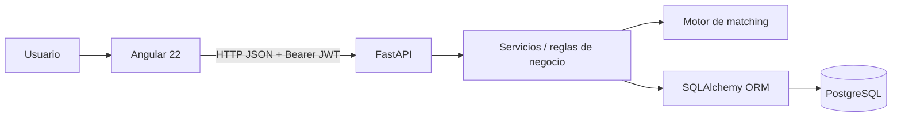
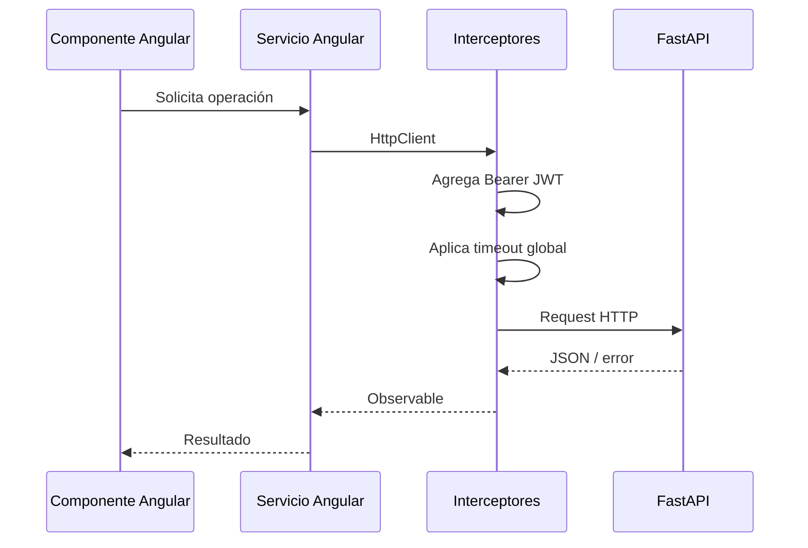
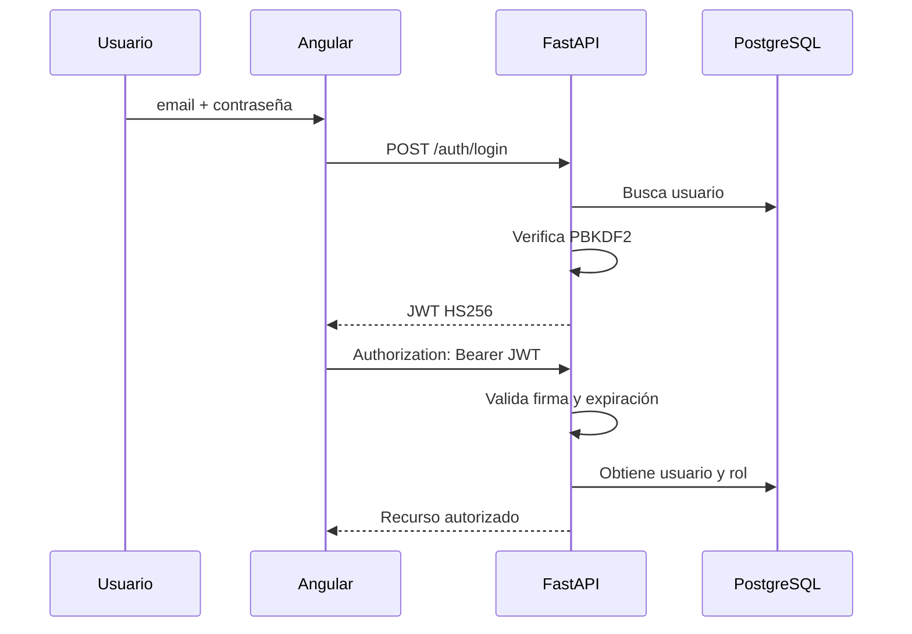
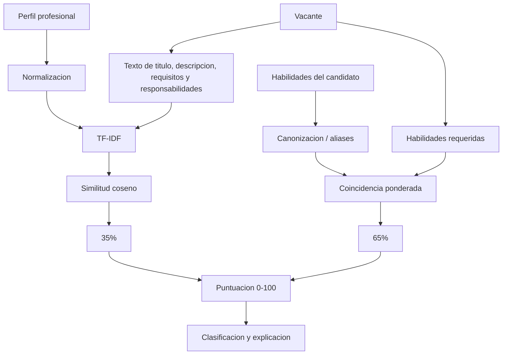

# Arquitectura de TalentIA

## 1. Vista general

TalentIA utiliza una arquitectura web cliente-servidor separada en tres capas principales:



## 2. Frontend

Angular es responsable de:

- navegación y experiencia de usuario;
- formularios;
- manejo de sesión en el navegador;
- consumo de la API mediante `HttpClient`;
- presentación de vacantes;
- edición del perfil;
- presentación del matching;
- seguimiento de postulaciones;
- panel de reclutador.

El frontend utiliza guards para experiencia de navegación, pero los guards no constituyen la barrera de seguridad definitiva. FastAPI valida nuevamente identidad y roles.

### Flujo HTTP



## 3. Backend

FastAPI se divide por routers:

```text
/auth
/usuarios
/empresas
/vacantes
/analisis
/postulaciones
```

Responsabilidades:

| Módulo | Responsabilidad |
|---|---|
| `auth.py` | Registro, login, sesión autenticada y logout |
| `usuarios.py` | Perfil del usuario y catálogo de habilidades |
| `empresas.py` | CRUD y desactivación lógica de empresas |
| `vacantes.py` | Consulta y gestión de vacantes |
| `analisis.py` | Compatibilidad candidato-vacante |
| `postulaciones.py` | Postulación, seguimiento, ranking y estados |

## 4. Persistencia

SQLAlchemy ORM representa el dominio mediante:

```text
Role
Empresa
Usuario
Habilidad
UsuarioHabilidad
Vacante
VacanteHabilidad
Postulacion
```

PostgreSQL conserva la información del perfil, habilidades, vacantes, relaciones y resultados del análisis.

## 5. Autenticación y autorización



La contraseña nunca se almacena en texto plano.

## 6. Matching

El motor se ejecuta en el backend:



## 7. Reglas importantes

- El registro público crea candidatos.
- Un candidato solo puede postularse una vez a la misma vacante.
- Un reclutador opera sobre información asociada a su empresa.
- Las empresas pueden desactivarse lógicamente.
- Las vacantes utilizan estados controlados.
- Las postulaciones usan transiciones de estado controladas.
- El score almacenado conserva el perfil utilizado durante el análisis.

## 8. Manejo de fallos

El proyecto incluye medidas para evitar interfaces congeladas:

- timeout global de llamadas al backend;
- liberación explícita de estados de carga;
- límites de conexión con PostgreSQL;
- `rollback()` ante errores de persistencia;
- control de respuestas tardías en vistas con selección dinámica.

## 9. Ejecución local

```text
Navegador
  |
  | localhost:4200
  v
Angular
  |
  | 127.0.0.1:8000
  v
FastAPI
  |
  | localhost:5432
  v
PostgreSQL
```

CORS permite los orígenes locales configurados para Angular.
