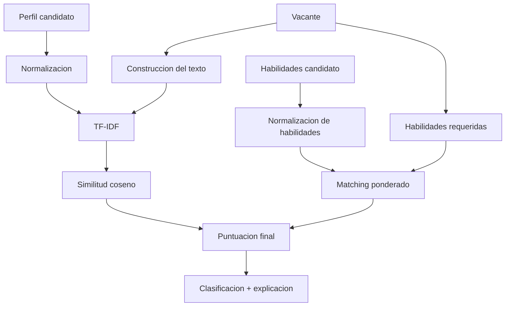

# Motor de compatibilidad de TalentIA

## Objetivo

El motor estima qué tan alineado está un perfil profesional con una vacante.

No pretende determinar quién debe ser contratado y no realiza rechazo automático de candidatos.

## Entradas

El análisis utiliza:

- perfil profesional del candidato;
- habilidades estructuradas del candidato;
- título de la vacante;
- descripción;
- requisitos;
- responsabilidades;
- habilidades requeridas y su peso.

## Flujo



## 1. Normalización textual

El texto:

- se convierte a minúsculas;
- elimina diacríticos;
- elimina caracteres no útiles;
- normaliza espacios.

Esto ayuda a comparar variantes como:

```text
ÁNGULAR
angular
```

## 2. Alias de habilidades

El motor incluye un catálogo de alias.

Ejemplos:

```text
postgres -> PostgreSQL
reactjs  -> React
k8s      -> Kubernetes
sklearn  -> Scikit-learn
ts       -> TypeScript
```

Esto mejora la detección sin depender únicamente de coincidencias literales exactas.

## 3. TF-IDF

TF-IDF representa los textos numéricamente según la importancia de sus términos.

TalentIA utiliza unigramas y bigramas:

```text
python
machine learning
spring boot
```

También elimina stopwords frecuentes del español y utiliza frecuencia sublineal para reducir el efecto de repetir una palabra muchas veces.

## 4. Similitud coseno

Después de vectorizar:

```text
perfil -> vector A
vacante -> vector B
```

se calcula la similitud coseno entre ambos vectores.

Resultado:

```text
0.0   = muy poca similitud
1.0   = máxima similitud
```

TalentIA lo convierte a un porcentaje de 0 a 100.

## 5. Coincidencia ponderada de habilidades

Cada habilidad requerida puede tener un peso de 1 a 5.

Ejemplo:

| Habilidad | Peso |
|---|---:|
| Angular | 5 |
| TypeScript | 5 |
| Git | 2 |

Si el candidato posee Angular y Git:

```text
peso obtenido = 5 + 2 = 7
peso total    = 5 + 5 + 2 = 12

coincidencia = 7 / 12 * 100
```

## 6. Puntuación final

Cuando existen habilidades requeridas:

```text
score =
    coincidencia_habilidades * 0.65
    +
    similitud_textual * 0.35
```

Por tanto:

```text
65% habilidades
35% texto
```

Si no es posible identificar habilidades requeridas, el motor utiliza la similitud textual para no introducir una penalización artificial.

## 7. Clasificación

```text
score < 40       -> baja
40 <= score < 65 -> media
65 <= score < 80 -> alta
80 <= score      -> muy_alta
```

## 8. Resultado

El motor devuelve:

```text
puntuacion
similitud_texto
coincidencia_habilidades
clasificacion
habilidades_coincidentes
habilidades_faltantes
explicacion
```

Cuando se crea una postulación, los resultados relevantes se guardan en PostgreSQL para que el reclutador pueda consultar posteriormente el ranking y la explicación.

## 9. Explicabilidad

TalentIA no muestra solamente un porcentaje.

También muestra:

- similitud textual;
- coincidencia de habilidades;
- fortalezas detectadas;
- habilidades faltantes;
- explicación en lenguaje natural.

Esto permite entender qué factores originaron el resultado.

## 10. Consideraciones éticas

El sistema debe utilizarse únicamente como apoyo.

No se debe interpretar un score bajo como prueba de incapacidad profesional.

El resultado puede verse afectado por:

- redacción del perfil;
- vocabulario utilizado;
- calidad de la descripción de la vacante;
- cobertura del catálogo de habilidades;
- ausencia de contexto profesional no expresado en texto.

La decisión final debe corresponder a una evaluación humana.
