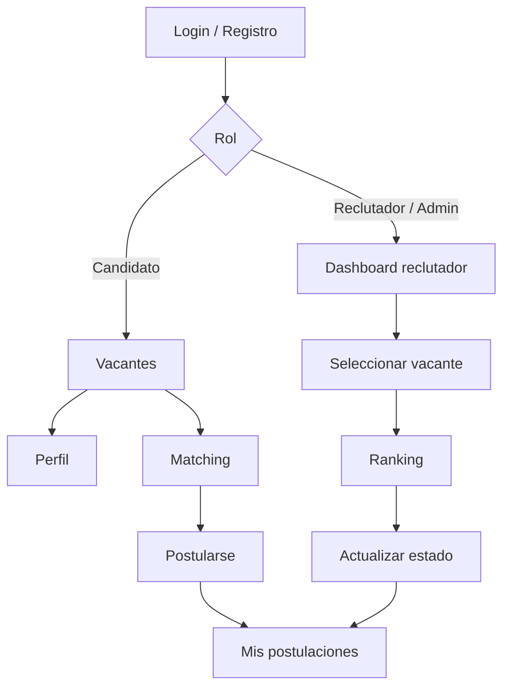

# Mockups funcionales — TalentIA

Este documento presenta los mockups funcionales de las pantallas principales de TalentIA.

Los mockups representan el flujo realmente implementado y sirven como evidencia de diseño previo/funcional para la entrega académica.

> Para la entrega final se recomienda acompañar este documento con capturas reales del navegador de las mismas pantallas.

---

## 1. Login

```text
┌──────────────────────────────────────────────────────────────────────┐
│ TalentIA                                              Cambiar tema ◐ │
├──────────────────────────────────────────────────────────────────────┤
│                                                                      │
│                 Bienvenido de nuevo a TalentIA                       │
│                                                                      │
│                 Correo electrónico                                  │
│                 ┌──────────────────────────────┐                     │
│                 │ ana@talentia.local           │                     │
│                 └──────────────────────────────┘                     │
│                                                                      │
│                 Contraseña                                          │
│                 ┌──────────────────────────────┐                     │
│                 │ ••••••••••••                 │                     │
│                 └──────────────────────────────┘                     │
│                                                                      │
│                 ┌──────────────────────────────┐                     │
│                 │       Iniciar sesión         │                     │
│                 └──────────────────────────────┘                     │
│                                                                      │
│                 ¿No tienes cuenta? Crear cuenta                      │
│                                                                      │
└──────────────────────────────────────────────────────────────────────┘
```

### Objetivo

Permitir autenticación mediante correo y contraseña.

### Reglas

- credenciales válidas → se almacena JWT;
- candidato → catálogo de vacantes;
- reclutador/administrador → panel de reclutamiento;
- credenciales inválidas → mensaje de error.

---

## 2. Registro de candidato

```text
┌──────────────────────────────────────────────────────────────────────┐
│ TalentIA                                                             │
├──────────────────────────────────────────────────────────────────────┤
│                                                                      │
│                       Crear cuenta                                   │
│                                                                      │
│ Nombre                         Apellido                               │
│ ┌────────────────────────┐     ┌────────────────────────┐            │
│ │ Ana                    │     │ Gómez                  │            │
│ └────────────────────────┘     └────────────────────────┘            │
│                                                                      │
│ Correo                                                               │
│ ┌──────────────────────────────────────────────────────┐             │
│ │ ana@email.com                                       │             │
│ └──────────────────────────────────────────────────────┘             │
│                                                                      │
│ Contraseña                                                           │
│ ┌──────────────────────────────────────────────────────┐             │
│ │ ••••••••••••                                        │             │
│ └──────────────────────────────────────────────────────┘             │
│                                                                      │
│                 ┌──────────────────────────────┐                     │
│                 │        Crear cuenta          │                     │
│                 └──────────────────────────────┘                     │
│                                                                      │
└──────────────────────────────────────────────────────────────────────┘
```

El registro público crea únicamente usuarios con rol `candidato`.

---

## 3. Catálogo de vacantes

```text
┌──────────────────────────────────────────────────────────────────────────┐
│ TalentIA   Vacantes   Mis postulaciones   Mi perfil        Ana G.   ◐  │
├──────────────────────────────────────────────────────────────────────────┤
│                                                                          │
│ Encuentra el trabajo que encaja contigo                                  │
│ [ Cargo, habilidad, empresa o ciudad...                       ] [Buscar] │
│                                                                          │
│ 10 oportunidades   3 empresas   2 remotas   5 híbridas                  │
│                                                                          │
│ [Todas] [Remoto] [Híbrido] [Presencial]            [Más recientes ▼]   │
│                                                                          │
│ ┌────────────────────────────┐  ┌────────────────────────────┐           │
│ │ T  TechNova Solutions     │  │ D  DataSphere Analytics  │           │
│ │                            │  │                            │           │
│ │ Desarrollador Angular Jr. │  │ Analista de Datos Jr.    │           │
│ │ Bucaramanga · 1 año       │  │ Bogotá · 1 año           │           │
│ │                            │  │                            │           │
│ │ Angular TypeScript REST   │  │ Python SQL Power BI      │           │
│ │ PostgreSQL Git            │  │ Pandas                    │           │
│ │                            │  │                            │           │
│ │ $...          híbrido     │  │ $...          híbrido     │           │
│ │                            │  │                            │           │
│ │ [✦ Evaluar con IA]        │  │ [✦ Evaluar con IA]        │           │
│ └────────────────────────────┘  └────────────────────────────┘           │
│                                                                          │
└──────────────────────────────────────────────────────────────────────────┘
```

### Funciones

- búsqueda;
- filtro por modalidad;
- ordenamiento;
- resumen estadístico;
- análisis de compatibilidad para candidatos;
- publicación/cierre para roles autorizados.

---

## 4. Panel de compatibilidad de una vacante

El candidato **no vuelve a escribir manualmente su perfil**.

TalentIA consulta el perfil persistido y las habilidades registradas.

```text
┌──────────────────────────────────────────────────────────────┐
│ ✦ TALENTIA MATCH                                            │
│ Evalúa tu compatibilidad                                    │
├──────────────────────────────────────────────────────────────┤
│ Perfil utilizado                                            │
│                                                              │
│ ✓ Perfil profesional actualizado                            │
│ ✓ 6 habilidades registradas                                 │
│ ✓ 4 años de experiencia                                     │
│                                                              │
│ Angular · TypeScript · JavaScript · REST · PostgreSQL · Git  │
│                                                              │
│ Resumen profesional                                         │
│ Desarrolladora frontend con experiencia en...               │
│                                                              │
│ [ ✦ Analizar mi perfil ]   [ Postularme ]                   │
│                                                              │
│ ¿Necesitas actualizar algo? Ir a mi perfil →                 │
└──────────────────────────────────────────────────────────────┘
```

### Resultado

```text
┌──────────────────────────────────────────────────────────────┐
│ Compatibilidad estimada                         82.4%         │
│ Clasificación                                  MUY ALTA       │
│ ████████████████████████████████████████                     │
│                                                              │
│ Texto / perfil        75.1%                                  │
│ Habilidades           86.3%                                  │
│                                                              │
│ Coincidencias                                                │
│ ✓ Angular  ✓ TypeScript  ✓ REST  ✓ Git                       │
│                                                              │
│ Por fortalecer                                               │
│ RxJS · Testing                                               │
│                                                              │
│ Interpretación                                               │
│ El perfil presenta una coincidencia alta debido a...         │
│                                                              │
│ Resultado orientativo. La decisión final corresponde         │
│ al equipo humano.                                            │
└──────────────────────────────────────────────────────────────┘
```

---

## 5. Perfil del candidato

### Modo lectura

```text
┌─────────────────────────────────────────────────────────────────────┐
│ Mi perfil                                         [✎ Editar perfil] │
├─────────────────────────────────────────────────────────────────────┤
│ Ana Gómez                                                            │
│ Candidata                                                             │
│                                                                       │
│ ┌──────────────────────────────┐  ┌───────────────────────────────┐  │
│ │ Información personal         │  │ Perfil completo              │  │
│ │ Nombre: Ana                  │  │ 100%                          │  │
│ │ Apellido: Gómez              │  │ ████████████████████████      │  │
│ │ Ciudad: Bucaramanga          │  │                               │  │
│ │ Teléfono: ...                │  │ Recomendación                 │  │
│ │ Experiencia: 4 años          │  │ Perfil listo para matching   │  │
│ └──────────────────────────────┘  └───────────────────────────────┘  │
│                                                                       │
│ Perfil profesional                                                    │
│ ┌─────────────────────────────────────────────────────────────────┐   │
│ │ Desarrolladora frontend con experiencia en Angular...          │   │
│ └─────────────────────────────────────────────────────────────────┘   │
│                                                                       │
│ Habilidades                                                            │
│ Angular        avanzado       4 años                                  │
│ TypeScript     avanzado       4 años                                  │
│ PostgreSQL     intermedio     2 años                                  │
│ ...                                                                   │
└─────────────────────────────────────────────────────────────────────┘
```

### Modo edición

```text
┌─────────────────────────────────────────────────────────────────────┐
│ Mi perfil                                         [Cancelar edición]│
├─────────────────────────────────────────────────────────────────────┤
│ Nombre [____________]     Apellido [____________]                    │
│ Ciudad [____________]     Teléfono [____________]                    │
│ Experiencia [ 4 ]                                                   │
│                                                                     │
│ Perfil profesional                                                  │
│ [                                                               ]   │
│ [                                                               ]   │
│                                                                     │
│ + Agregar habilidad                                                 │
│ Habilidad        Nivel          Experiencia                         │
│ Angular          [Avanzado ▼]   [4]                   [Eliminar]    │
│                                                                     │
│                                      [ Guardar cambios ]            │
└─────────────────────────────────────────────────────────────────────┘
```

La edición se habilita únicamente después de pulsar `Editar perfil`.

---

## 6. Mis postulaciones

```text
┌────────────────────────────────────────────────────────────────────────┐
│ Mis postulaciones                                                      │
├────────────────────────────────────────────────────────────────────────┤
│ Total: 3        En proceso: 2        Seleccionadas: 1                   │
│                                                                        │
│ ┌────────────────────────────────────────────────────────────────────┐ │
│ │ Desarrollador Angular Junior                    82.4%              │ │
│ │ TechNova Solutions                                                  │ │
│ │                                                                    │ │
│ │ Estado: EN REVISIÓN                                                │ │
│ │ Pendiente ──● Revisión ──○ Entrevista ──○ Seleccionado            │ │
│ │                                                                    │ │
│ │ Coincidencias: Angular · TypeScript · Git                          │ │
│ │ Por fortalecer: RxJS                                               │ │
│ │                                                                    │ │
│ │ Interpretación del matching...                                     │ │
│ └────────────────────────────────────────────────────────────────────┘ │
│                                                                        │
│ El score ayuda a comprender la coincidencia, pero no                  │
│ determina automáticamente una contratación o rechazo.                 │
└────────────────────────────────────────────────────────────────────────┘
```

---

## 7. Dashboard del reclutador

```text
┌─────────────────────────────────────────────────────────────────────────┐
│ TalentIA                  Panel de reclutamiento            Reclutador  │
├─────────────────────────────────────────────────────────────────────────┤
│ Candidatos: 8    En revisión: 3    Entrevistas: 2    Seleccionados: 1 │
│                                                                         │
│ Vacante                                                                │
│ [ Desarrollador Angular Junior                                  ▼ ]    │
│                                                                         │
│ [Todos] [Pendiente] [Revisión] [Entrevista] [Seleccionado] [Rechazado]│
│                                                                         │
│ RANKING                                                                 │
│                                                                         │
│ #1 Ana Gómez                                      82.4% · Muy alta      │
│    ana@talentia.local                                                  │
│                                                                         │
│    Texto: 75.1%      Habilidades: 86.3%                                │
│    ✓ Angular ✓ TypeScript ✓ Git                                        │
│    Faltantes: RxJS                                                     │
│                                                                         │
│    Estado: En revisión                                                 │
│    [Pasar a entrevista] [Rechazar]                                     │
│                                                                         │
│ #2 Juan ...                                                            │
└─────────────────────────────────────────────────────────────────────────┘
```

### Principio de diseño

El ranking ordena por compatibilidad, pero el estado de un candidato cambia únicamente por una acción explícita del reclutador.

---

## 8. Flujo general de pantallas



---

## 9. Evidencias finales recomendadas

Para la presentación y entrega final, tomar capturas reales de:

1. Login.
2. Registro.
3. Perfil completo.
4. Catálogo de vacantes.
5. Panel de compatibilidad.
6. Resultado del matching.
7. Mis postulaciones.
8. Dashboard del reclutador.
9. Cambio de estado.
10. Swagger.
11. PostgreSQL desde `psql`.
12. Build/tests exitosos.

Estas capturas pueden anexarse en `docs/evidencias/`.
