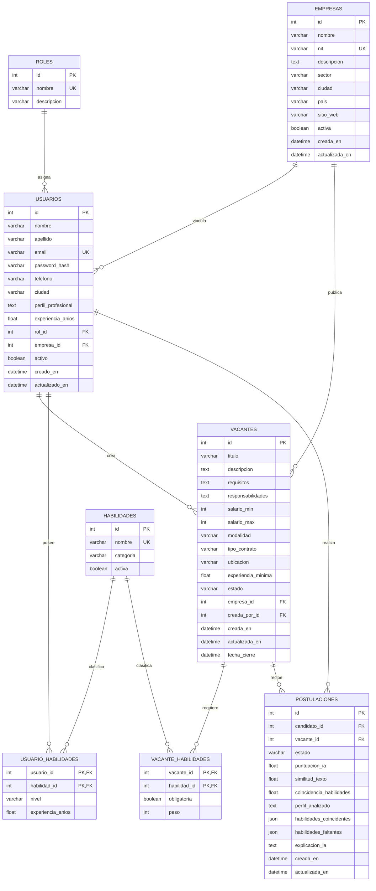

# Modelo de datos y normalización

## Diagrama entidad-relación



## Relaciones principales

- Un rol puede pertenecer a muchos usuarios.
- Una empresa puede tener varios usuarios asociados.
- Una empresa puede publicar muchas vacantes.
- Un usuario reclutador o administrador puede crear varias vacantes.
- Usuarios y habilidades forman una relación N:M mediante `usuario_habilidades`.
- Vacantes y habilidades forman una relación N:M mediante `vacante_habilidades`.
- Candidatos y vacantes forman una relación N:M mediante `postulaciones`.

## Restricciones de integridad

### Usuarios

```text
email UNIQUE
experiencia_anios >= 0
```

### Usuario-habilidad

```text
PK(usuario_id, habilidad_id)
nivel IN (basico, intermedio, avanzado, experto)
experiencia_anios >= 0
```

### Vacantes

```text
salario_min >= 0
salario_max >= 0
salario_min <= salario_max
experiencia_minima >= 0
modalidad IN (remoto, presencial, hibrido)
estado IN (borrador, activa, pausada, cerrada)
```

### Vacante-habilidad

```text
PK(vacante_id, habilidad_id)
peso BETWEEN 1 AND 5
```

### Postulaciones

```text
UNIQUE(candidato_id, vacante_id)
estado IN (
    pendiente,
    revision,
    entrevista,
    seleccionado,
    rechazado
)
puntuacion_ia BETWEEN 0 AND 100
similitud_texto BETWEEN 0 AND 100
coincidencia_habilidades BETWEEN 0 AND 100
```

## Normalización

### Primera Forma Normal — 1FN

Cada tabla tiene filas identificables y columnas destinadas a un único concepto.

Las habilidades no se almacenan como una cadena como:

```text
"Angular, TypeScript, Git, PostgreSQL"
```

sino mediante un catálogo y tablas puente.

### Segunda Forma Normal — 2FN

Las entidades principales utilizan una clave primaria simple `id`.

En las tablas con clave compuesta:

```text
usuario_habilidades
vacante_habilidades
```

los atributos adicionales dependen de la relación completa.

Por ejemplo, `nivel` depende de un usuario específico y una habilidad específica.

### Tercera Forma Normal — 3FN

Los datos descriptivos se almacenan en su entidad correspondiente.

Ejemplos:

- el nombre de un rol está en `roles`, no repetido en `usuarios`;
- el nombre de una empresa está en `empresas`, no repetido en `vacantes`;
- el nombre de una habilidad está en `habilidades`, no duplicado en las tablas puente.

Esto reduce anomalías de actualización e inconsistencias.

## Decisiones de diseño

`postulaciones` conserva `perfil_analizado` y los resultados del matching. Esto es intencional: representa una fotografía del análisis realizado en ese momento, aunque el candidato modifique posteriormente su perfil.

Los arrays de habilidades coincidentes y faltantes se almacenan como JSON porque forman parte del resultado histórico del análisis y no constituyen el catálogo principal de habilidades.
