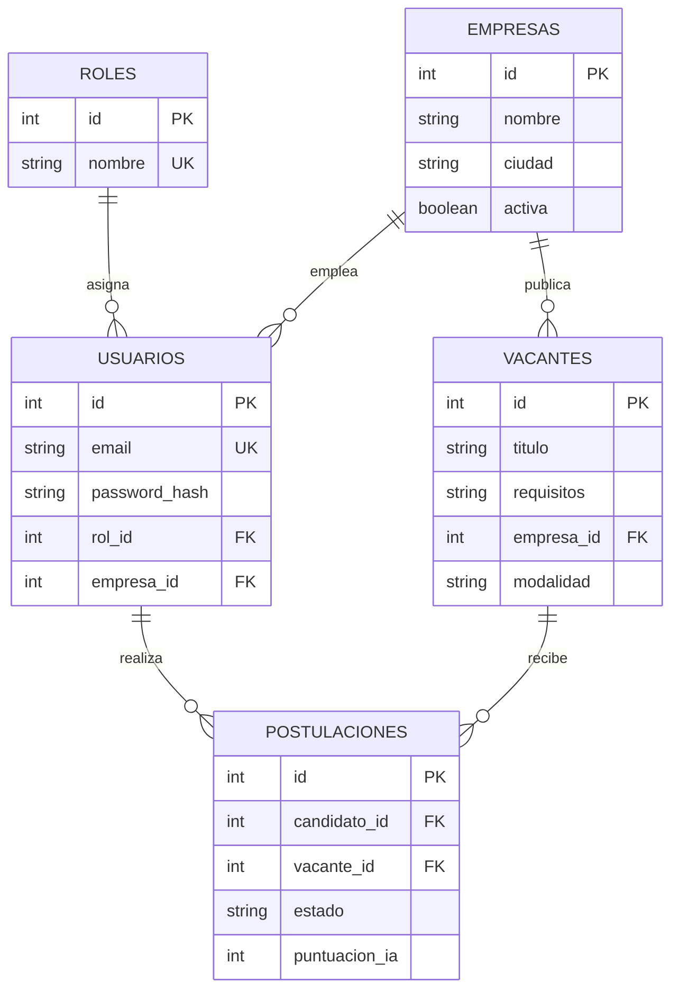

# Modelo entidad-relación y normalización

**PK**: `id` de cada entidad. **FK**: `usuarios.rol_id`, `usuarios.empresa_id`, `vacantes.empresa_id`, `postulaciones.candidato_id` y `postulaciones.vacante_id`. Una persona puede tener muchas postulaciones; una vacante puede recibir muchas; la tabla puente resuelve N:M. Restricción única `(candidato_id,vacante_id)`.

**1FN**: columnas atómicas y sin grupos repetidos; cada fila identificada por PK. **2FN**: todas las tablas tienen PK simple `id`, y sus atributos no dependen de una parte de una clave compuesta. **3FN**: nombre de rol reside en `roles` y nombre de empresa en `empresas`; las demás tablas referencian sus IDs en vez de duplicarlos. Los requisitos de la vacante se almacenan como texto libre, adecuado al alcance académico; un catálogo de habilidades requeriría entidades adicionales para búsquedas avanzadas.

**Reglas**: correo único, candidato-vacante único, salario mínimo <= máximo validado por API, permisos por rol, estados controlados por API.
